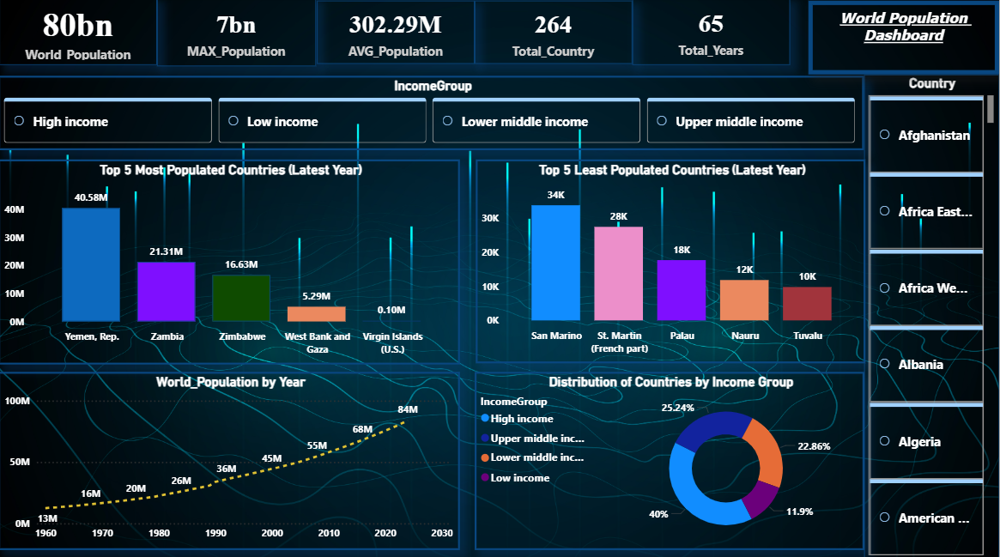

# 🌍 Global Population Dashboard

## 📊 About This Project

This is a simple data analysis project where I created a dashboard to understand global population trends. The dashboard shows how population has changed over time for different countries.

## 🎯 Objective

The main goal of this project is to explore population data and find useful insights like which countries have the highest and lowest population and how population is growing over the years.

## 🧹 Data Cleaning

The dataset was cleaned using Power Query in Power BI:

* Removed unnecessary columns
* Handled missing values
* Changed data types
* Filtered data for proper analysis

## 📁 Dataset

The dataset used in this project is included in this repository (`dataset.csv`).

## 🛠️ Tools Used

* Power BI
* Power Query
* CSV File

 ## 📌 Key Insights

- 🌍 **Steady Population Growth:** Global population has shown a consistent upward trend from 1960 and is projected to continue growing through 2030.

- 📈 **Rapid Growth After 2000:** The population growth rate has accelerated significantly in the 21st century.

- 🌐 **Uneven Population Distribution:** A small number of countries contribute a large share of the global population, while many countries have very low population counts.

- 🏙️ **Top vs Least Populated Gap:** There is a massive difference between the most populated countries (e.g., Yemen, Zambia) and the least populated ones (e.g., San Marino, Tuvalu).

- 💰 **Income Group Imbalance:** A large proportion of countries fall under the **high-income group (~40%)**, whereas **low-income countries (~11.9%)** represent a much smaller share.

- 📊 **Skewed Population Data:** The average population (~302M) is significantly lower than the maximum (~7B), indicating that population distribution is highly skewed.

- 🧭 **Wide Dataset Coverage:** The dataset includes **264 countries across 65 years**, making it suitable for long-term trend analysis.

- 🔍 **Insightful Filtering:** Income group and country-level filters allow deeper exploration of population patterns and economic segmentation.

> 📢 Overall, the analysis highlights that global population growth is consistent, but its distribution remains highly unequal across countries and income groups.
## 🖼️ Dashboard Preview

## ▶️ How to Use

1. Download the `.pbix` file
2. Open it in Power BI Desktop
3. Explore different visuals and filters

## 📌 Note

This is a beginner-friendly project created for learning data analysis and visualization.

## 👨‍💻 Author

Raj Ansh
